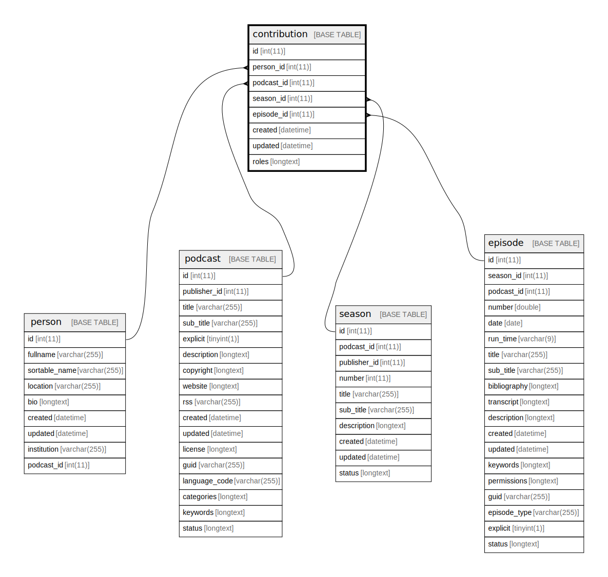

  

    Table of contents
  

  {: .text-delta }
1. TOC
{:toc}

# `contribution`

## Description

## Columns

|Name|Type|Default|Nullable|Extra Definition|Children|Parents|Comment|
|----|----|-------|--------|----------------|--------|-------|-------|
|id|int(11)||false|auto_increment||||
|person_id|int(11)||false|||[person](person.md)||
|podcast_id|int(11)|NULL|true|||[podcast](podcast.md)||
|season_id|int(11)|NULL|true|||[season](season.md)||
|episode_id|int(11)|NULL|true|||[episode](episode.md)||
|created|datetime||false||||(DC2Type:datetime_immutable)|
|updated|datetime||false||||(DC2Type:datetime_immutable)|
|roles|longtext|'[]'|false||||(DC2Type:json)|

## Constraints

| Name | Type | Definition |
| ---- | ---- | ---------- |
| FK_EA351E15217BBB47 | FOREIGN KEY | FOREIGN KEY (person_id) REFERENCES person (id) |
| FK_EA351E15362B62A0 | FOREIGN KEY | FOREIGN KEY (episode_id) REFERENCES episode (id) |
| FK_EA351E154EC001D1 | FOREIGN KEY | FOREIGN KEY (season_id) REFERENCES season (id) |
| FK_EA351E15786136AB | FOREIGN KEY | FOREIGN KEY (podcast_id) REFERENCES podcast (id) |
| PRIMARY | PRIMARY KEY | PRIMARY KEY (id) |
| roles | CHECK | CHECK (json_valid(`roles`)) |

## Indexes

| Name | Definition |
| ---- | ---------- |
| IDX_EA351E15217BBB47 | KEY IDX_EA351E15217BBB47 (person_id) USING BTREE |
| IDX_EA351E15362B62A0 | KEY IDX_EA351E15362B62A0 (episode_id) USING BTREE |
| IDX_EA351E154EC001D1 | KEY IDX_EA351E154EC001D1 (season_id) USING BTREE |
| IDX_EA351E15786136AB | KEY IDX_EA351E15786136AB (podcast_id) USING BTREE |
| PRIMARY | PRIMARY KEY (id) USING BTREE |

## Relations

---

> Generated by [tbls](https://github.com/k1LoW/tbls)

