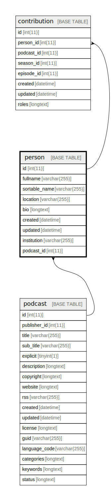

  

    Table of contents
  

  {: .text-delta }
1. TOC
{:toc}

# `person`

## Description

## Columns

|Name|Type|Default|Nullable|Extra Definition|Children|Parents|Comment|
|----|----|-------|--------|----------------|--------|-------|-------|
|id|int(11)||false|auto_increment|[contribution](contribution.md)|||
|fullname|varchar(255)||false|||||
|sortable_name|varchar(255)||false|||||
|location|varchar(255)||false|||||
|bio|longtext||false|||||
|created|datetime||false||||(DC2Type:datetime_immutable)|
|updated|datetime||false||||(DC2Type:datetime_immutable)|
|institution|varchar(255)|NULL|true|||||
|podcast_id|int(11)||false|||[podcast](podcast.md)||

## Constraints

| Name | Type | Definition |
| ---- | ---- | ---------- |
| FK_34DCD176786136AB | FOREIGN KEY | FOREIGN KEY (podcast_id) REFERENCES podcast (id) |
| PRIMARY | PRIMARY KEY | PRIMARY KEY (id) |

## Indexes

| Name | Definition |
| ---- | ---------- |
| IDX_34DCD176786136AB | KEY IDX_34DCD176786136AB (podcast_id) USING BTREE |
| person_ft | KEY person_ft (fullname, bio) USING FULLTEXT |
| PRIMARY | PRIMARY KEY (id) USING BTREE |

## Relations

---

> Generated by [tbls](https://github.com/k1LoW/tbls)

