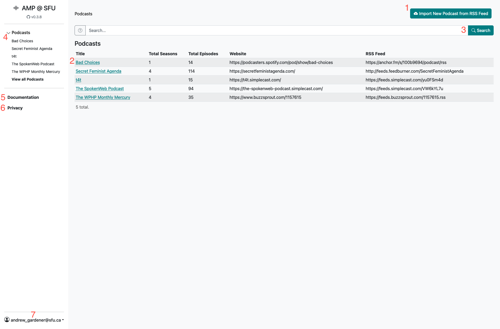
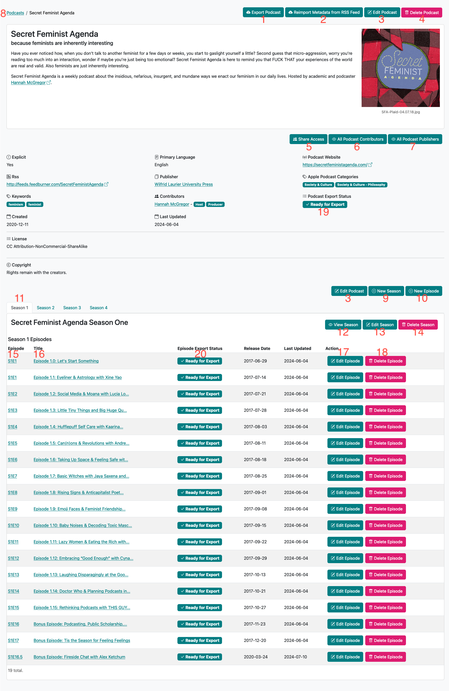

  

    Table of contents
  

  {: .text-delta }
1. TOC
{:toc}

# How do I...





<ul>

  <li>
    <a href="{{ child.url | relative_url }}">{{ child.title }}</a> - {{ child.summary }}
  </li>

</ul>

# Navigation Pages

## Homepage

{: .text-center }

1. __Import New Podcast from RSS Feed:__ Navigate to import page where you can input RSS URL for import
2. __Title:__ The podcast title, and link to the podcast page on AMP
3. __Search:__ Filter listed podcasts by keywords
4. __Podcasts (menu):__ Side menu listing a user’s podcasts
5. __Documentation:__ Side menu linking to documentation of how to use the AMP tool
6. __Privacy:__ Information on our policies regarding the collection, use, and disclosure of personal data
7. __User Account:__ Drop-down menu to navigate to Profile, Change Password, and Logout

## Podcast Page

{: .text-center }

1. __Export Podcast:__ Export your podcast metadata in a variety of formats (ex: _Islandora_)
2. __Reimport Metadata from RSS Feed:__ Import additional/new material from your RSS feed
3. __Edit Podcast:__ Edit the podcast metadata
4. __Delete Podcast:__ Delete the podcast from the AMP server
5. __Share Access:__ Share podcast with other AMP users. Allows collaborative editing of metadata and exporting
6. __All Podcast Contributions:__ View all people who have contributed to the podcast. Allows editing their metadata
7. __All Podcast Publishers:__ View all organizations who have published the podcast. Allows editing their metadata
8. __Breadcrumb Trail Menu:__ Quick navigation to parent pages
9. __New Season:__ Manually create a new podcast season (_recommended to use RRS import instead_)
10. __New Episode:__ Manually create a new podcast episode (_recommended to use RRS import instead_)
11. __Season Selection Tab:__ Select the season to list episodes and view metadata
12. __View Season:__ View a season's metadata
13. __Edit Season:__ Edit metadata for a season
14. __Delete Season:__ Delete a season from the AMP server
15. __Episode #:__ The season and episode number slug. Links to the episode's metadata page
16. __Episode #:__ The title of the episode. Links to the episode's metadata page
17. __Edit Episode:__ Edit metadata for an episode
18. __Delete Episode:__ Delete an episode from the AMP server
19. __Podcast Export Status:__ Lists the export status for the entire podcast. If you see __Ready for Export__, then your podcast meets the minimum amount of meta required for exporting. If you see __View Missing Metadata__, click to see all missing metadata from the podcast, all seasons, and all episodes.
20. __Episode Export Status:__ Lists the export status for the episode. If you see __Ready for Export__, then your episode meets the minimum amount of meta required for exporting. If you see __View Missing Metadata__, click to see all missing metadata from the episode.