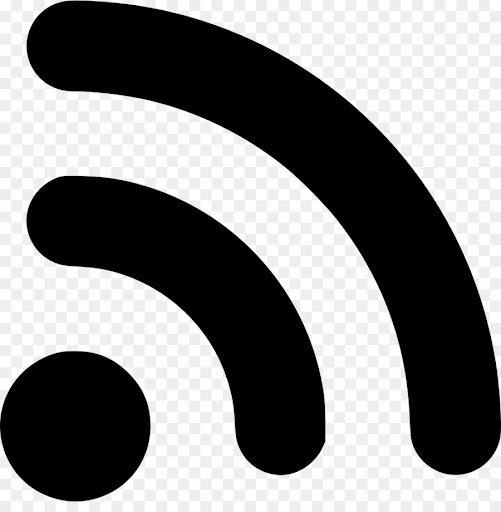

# How do I import a podcast?

Importing via an RSS feed URL automatically imports your podcast's audio files and title cards as well as imports a large amount metadata required by AMP. This is meant to save you time from having to manually input all your podcast's metadata.

1. On the homepage, in the top right corner click __Import New Podcast from RSS Feed__
1. On import page, enter RSS feed URL in the __Rss *__ bar and click __Import__
1. Wait for the podcast to import
1. Click __View Podcast__ button to navigate to your imported podcast

{: .important-title }
> Where is my RSS feed URL?
> 1. On your podcast website, look for the RSS icon: {: width="18" } {: width="18" }
> 1. Click on the icon to open the __RSS feed__
> 1. On the RSS feed page, highlight the URL in the browser form
> 1. Click __Edit__ in the top menu of your browser, then from the drop down menu select __Copy__
> 1. You can now paste the URL directly into the AMP import form