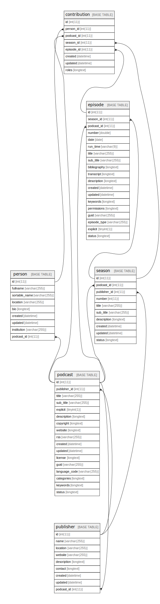

  

    Table of contents
  

  {: .text-delta }
1. TOC
{:toc}

# amplify

## Tables

| Name | Columns | Comment | Type |
| ---- | ------- | ------- | ---- |
| [contribution](contribution.md) | 8 |  | BASE TABLE |
| [episode](episode.md) | 19 |  | BASE TABLE |
| [person](person.md) | 9 |  | BASE TABLE |
| [podcast](podcast.md) | 17 |  | BASE TABLE |
| [publisher](publisher.md) | 9 |  | BASE TABLE |
| [season](season.md) | 10 |  | BASE TABLE |

## Relations

---

> Generated by [tbls](https://github.com/k1LoW/tbls)

