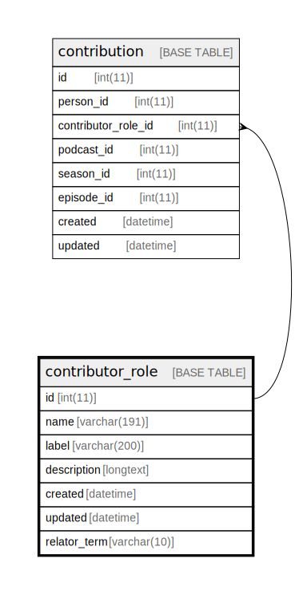

  

    Table of contents
  

  {: .text-delta }
1. TOC
{:toc}

# `contributor_role`

## Description

## Columns

|Name|Type|Default|Nullable|Extra Definition|Children|Parents|Comment|
|----|----|-------|--------|----------------|--------|-------|-------|
|id|int(11)||false|auto_increment|[contribution](contribution.md)|||
|name|varchar(191)||false|||||
|label|varchar(200)||false|||||
|description|longtext|NULL|true|||||
|created|datetime||false||||(DC2Type:datetime_immutable)|
|updated|datetime||false||||(DC2Type:datetime_immutable)|
|relator_term|varchar(10)|NULL|true|||||

## Constraints

| Name | Type | Definition |
| ---- | ---- | ---------- |
| PRIMARY | PRIMARY KEY | PRIMARY KEY (id) |
| UNIQ_8421DF245E237E06 | UNIQUE | UNIQUE KEY UNIQ_8421DF245E237E06 (name) |

## Indexes

| Name | Definition |
| ---- | ---------- |
| IDX_8421DF246DE44026 | KEY IDX_8421DF246DE44026 (description) USING FULLTEXT |
| IDX_8421DF24EA750E8 | KEY IDX_8421DF24EA750E8 (label) USING FULLTEXT |
| IDX_8421DF24EA750E86DE44026 | KEY IDX_8421DF24EA750E86DE44026 (label, description) USING FULLTEXT |
| PRIMARY | PRIMARY KEY (id) USING BTREE |
| UNIQ_8421DF245E237E06 | UNIQUE KEY UNIQ_8421DF245E237E06 (name) USING BTREE |

## Relations

---

> Generated by [tbls](https://github.com/k1LoW/tbls)

