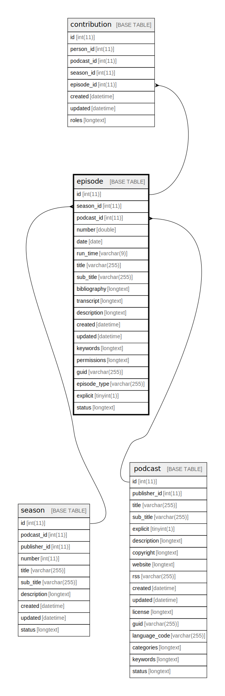

  

    Table of contents
  

  {: .text-delta }
1. TOC
{:toc}

# `episode`

## Description

## Columns

|Name|Type|Default|Nullable|Extra Definition|Children|Parents|Comment|
|----|----|-------|--------|----------------|--------|-------|-------|
|id|int(11)||false|auto_increment|[contribution](contribution.md)|||
|season_id|int(11)|NULL|true|||[season](season.md)||
|podcast_id|int(11)||false|||[podcast](podcast.md)||
|number|int(11)||false|||||
|date|date||false|||||
|run_time|varchar(9)||false|||||
|title|varchar(255)||false|||||
|sub_title|varchar(255)|NULL|true|||||
|bibliography|longtext|NULL|true|||||
|transcript|longtext|NULL|true|||||
|description|longtext||false|||||
|created|datetime||false||||(DC2Type:datetime_immutable)|
|updated|datetime||false||||(DC2Type:datetime_immutable)|
|keywords|longtext|'[]'|false||||(DC2Type:json)|
|permissions|longtext|NULL|true|||||
|guid|varchar(255)|NULL|true|||||
|episode_type|varchar(255)|'full'|false|||||
|explicit|tinyint(1)|NULL|true|||||

## Constraints

| Name | Type | Definition |
| ---- | ---- | ---------- |
| FK_DDAA1CDA4EC001D1 | FOREIGN KEY | FOREIGN KEY (season_id) REFERENCES season (id) |
| FK_DDAA1CDA786136AB | FOREIGN KEY | FOREIGN KEY (podcast_id) REFERENCES podcast (id) |
| PRIMARY | PRIMARY KEY | PRIMARY KEY (id) |

## Indexes

| Name | Definition |
| ---- | ---------- |
| IDX_DDAA1CDA4EC001D1 | KEY IDX_DDAA1CDA4EC001D1 (season_id) USING BTREE |
| IDX_DDAA1CDA786136AB | KEY IDX_DDAA1CDA786136AB (podcast_id) USING BTREE |
| PRIMARY | PRIMARY KEY (id) USING BTREE |

## Relations

---

> Generated by [tbls](https://github.com/k1LoW/tbls)

