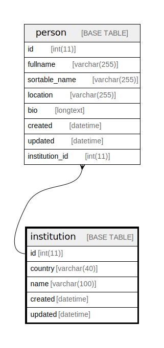

  

    Table of contents
  

  {: .text-delta }
1. TOC
{:toc}

# `institution`

## Description

## Columns

|Name|Type|Default|Nullable|Extra Definition|Children|Parents|Comment|
|----|----|-------|--------|----------------|--------|-------|-------|
|id|int(11)||false|auto_increment|[person](person.md)|||
|country|varchar(40)||false|||||
|name|varchar(100)||false|||||
|created|datetime||false||||(DC2Type:datetime_immutable)|
|updated|datetime||false||||(DC2Type:datetime_immutable)|

## Constraints

| Name | Type | Definition |
| ---- | ---- | ---------- |
| institutions_uniq | UNIQUE | UNIQUE KEY institutions_uniq (country, name) |
| PRIMARY | PRIMARY KEY | PRIMARY KEY (id) |

## Indexes

| Name | Definition |
| ---- | ---------- |
| institution_ft | KEY institution_ft (name) USING FULLTEXT |
| PRIMARY | PRIMARY KEY (id) USING BTREE |
| institutions_uniq | UNIQUE KEY institutions_uniq (country, name) USING BTREE |

## Relations

---

> Generated by [tbls](https://github.com/k1LoW/tbls)

