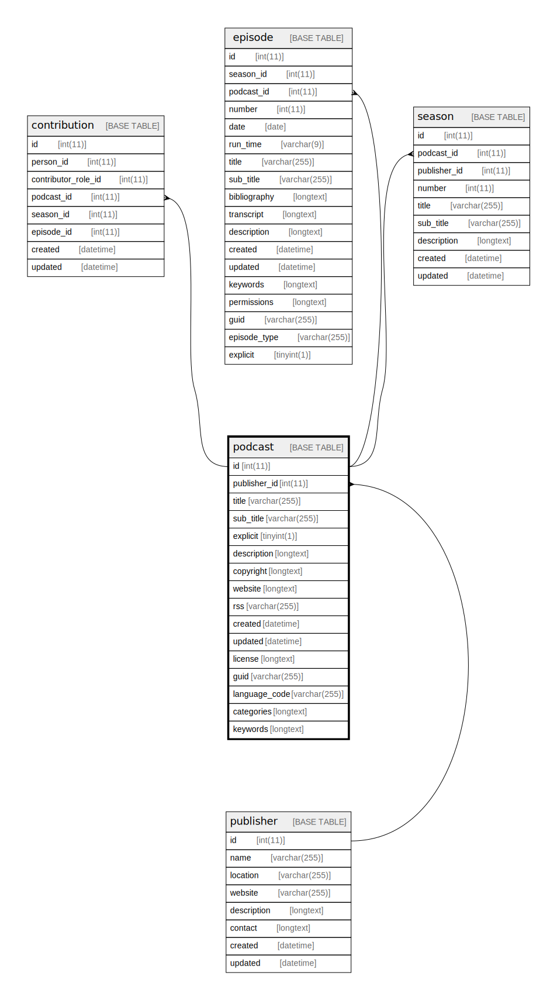

  

    Table of contents
  

  {: .text-delta }
1. TOC
{:toc}

# `podcast`

## Description

## Columns

|Name|Type|Default|Nullable|Extra Definition|Children|Parents|Comment|
|----|----|-------|--------|----------------|--------|-------|-------|
|id|int(11)||false|auto_increment|[contribution](contribution.md) [episode](episode.md) [season](season.md)|||
|publisher_id|int(11)|NULL|true|||[publisher](publisher.md)||
|title|varchar(255)||false|||||
|sub_title|varchar(255)|NULL|true|||||
|explicit|tinyint(1)||false|||||
|description|longtext||false|||||
|copyright|longtext||false|||||
|website|longtext||false|||||
|rss|varchar(255)||false|||||
|created|datetime||false||||(DC2Type:datetime_immutable)|
|updated|datetime||false||||(DC2Type:datetime_immutable)|
|license|longtext|NULL|true|||||
|guid|varchar(255)|NULL|true|||||
|language_code|varchar(255)|NULL|true|||||
|categories|longtext|'[]'|false||||(DC2Type:json)|
|keywords|longtext|'[]'|false||||(DC2Type:json)|

## Constraints

| Name | Type | Definition |
| ---- | ---- | ---------- |
| FK_D7E805BD40C86FCE | FOREIGN KEY | FOREIGN KEY (publisher_id) REFERENCES publisher (id) |
| PRIMARY | PRIMARY KEY | PRIMARY KEY (id) |

## Indexes

| Name | Definition |
| ---- | ---------- |
| IDX_D7E805BD40C86FCE | KEY IDX_D7E805BD40C86FCE (publisher_id) USING BTREE |
| podcast_ft | KEY podcast_ft (title, sub_title, description) USING FULLTEXT |
| PRIMARY | PRIMARY KEY (id) USING BTREE |

## Relations

---

> Generated by [tbls](https://github.com/k1LoW/tbls)

