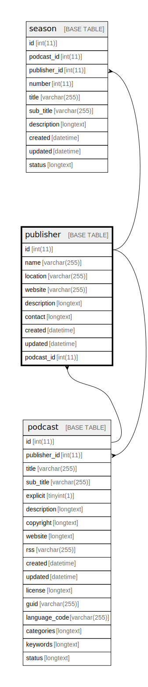

  

    Table of contents
  

  {: .text-delta }
1. TOC
{:toc}

# `publisher`

## Description

## Columns

|Name|Type|Default|Nullable|Extra Definition|Children|Parents|Comment|
|----|----|-------|--------|----------------|--------|-------|-------|
|id|int(11)||false|auto_increment|[podcast](podcast.md) [season](season.md)|||
|name|varchar(255)||false|||||
|location|varchar(255)|NULL|true|||||
|website|varchar(255)|NULL|true|||||
|description|longtext||false|||||
|contact|longtext||false|||||
|created|datetime||false||||(DC2Type:datetime_immutable)|
|updated|datetime||false||||(DC2Type:datetime_immutable)|

## Constraints

| Name | Type | Definition |
| ---- | ---- | ---------- |
| PRIMARY | PRIMARY KEY | PRIMARY KEY (id) |

## Indexes

| Name | Definition |
| ---- | ---------- |
| publisher_ft | KEY publisher_ft (name, description) USING FULLTEXT |
| PRIMARY | PRIMARY KEY (id) USING BTREE |

## Relations

---

> Generated by [tbls](https://github.com/k1LoW/tbls)

