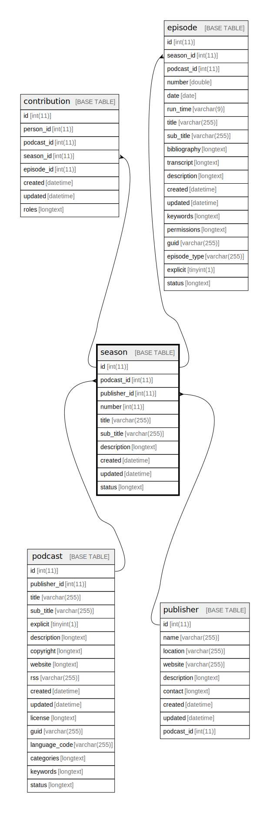

  

    Table of contents
  

  {: .text-delta }
1. TOC
{:toc}

# `season`

## Description

## Columns

|Name|Type|Default|Nullable|Extra Definition|Children|Parents|Comment|
|----|----|-------|--------|----------------|--------|-------|-------|
|id|int(11)||false|auto_increment|[contribution](contribution.md) [episode](episode.md)|||
|podcast_id|int(11)||false|||[podcast](podcast.md)||
|publisher_id|int(11)|NULL|true|||[publisher](publisher.md)||
|number|int(11)|NULL|true|||||
|title|varchar(255)||false|||||
|sub_title|varchar(255)|NULL|true|||||
|description|longtext||false|||||
|created|datetime||false||||(DC2Type:datetime_immutable)|
|updated|datetime||false||||(DC2Type:datetime_immutable)|
|status|longtext|'[]'|false||||(DC2Type:json)|

## Constraints

| Name | Type | Definition |
| ---- | ---- | ---------- |
| FK_F0E45BA940C86FCE | FOREIGN KEY | FOREIGN KEY (publisher_id) REFERENCES publisher (id) |
| FK_F0E45BA9786136AB | FOREIGN KEY | FOREIGN KEY (podcast_id) REFERENCES podcast (id) |
| PRIMARY | PRIMARY KEY | PRIMARY KEY (id) |
| status | CHECK | CHECK (json_valid(`status`)) |
| status | CHECK | CHECK (json_valid(`status`)) |
| status | CHECK | CHECK (json_valid(`status`)) |

## Indexes

| Name | Definition |
| ---- | ---------- |
| IDX_F0E45BA940C86FCE | KEY IDX_F0E45BA940C86FCE (publisher_id) USING BTREE |
| IDX_F0E45BA9786136AB | KEY IDX_F0E45BA9786136AB (podcast_id) USING BTREE |
| PRIMARY | PRIMARY KEY (id) USING BTREE |

## Relations

---

> Generated by [tbls](https://github.com/k1LoW/tbls)

